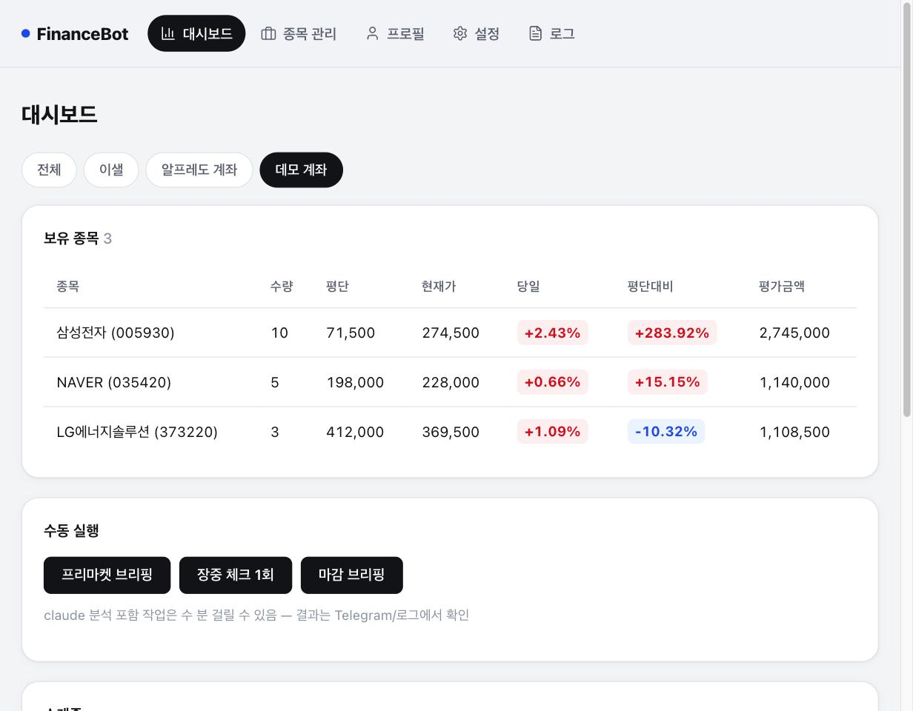
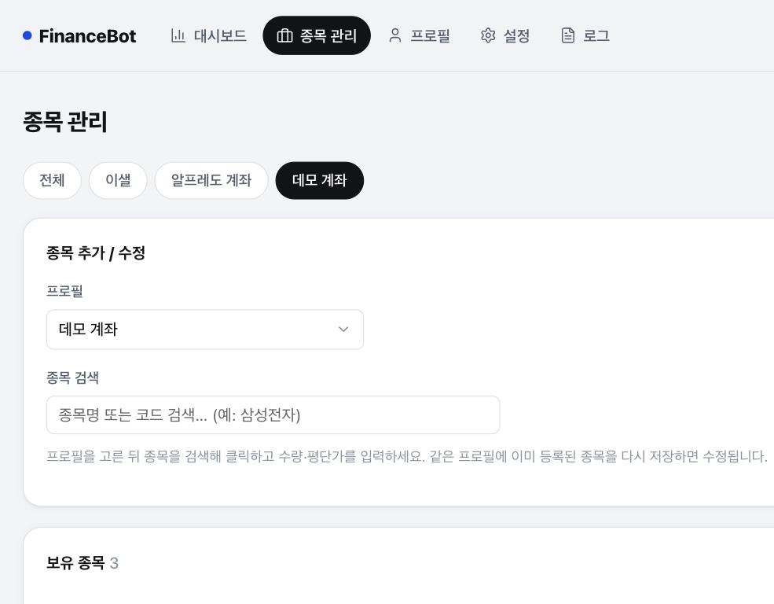
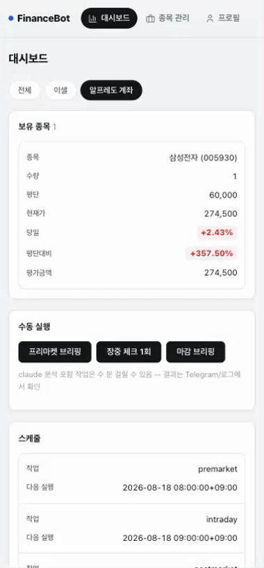
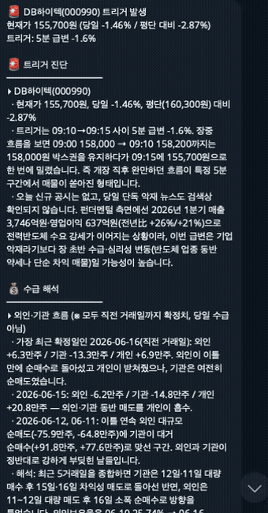
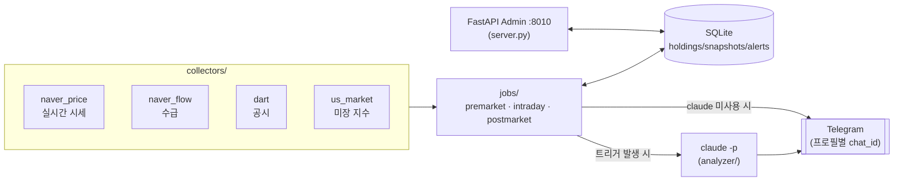

# WSID Finance Bot

**국내주식 보유 종목을 등록하면, 장 전/중/후로 시장을 모니터링하고 Telegram으로 알려주는 개인용 봇.**
Claude API 대신 로컬에 로그인된 `claude -p` (Claude Code CLI, 구독 기반)를 그대로 호출해 분석 비용 없이 동작합니다.

<div align="center">



</div>

> [!NOTE]
> 스크린샷은 데모 데이터입니다. 실제 화면에는 본인이 등록한 종목만 표시됩니다.

---

## 목차

- [기능](#기능)
- [데모](#데모)
- [하루 흐름](#하루-흐름-kst-거래일만)
- [빠른 시작](#빠른-시작)
- [Admin 페이지](#admin-페이지-httplocalhost8010)
- [아키텍처](#아키텍처)
- [설정값](#설정값-settings-페이지)
- [보안 및 주의사항](#보안-및-주의사항)

## 기능

- **자동 브리핑**: 장 전/중/후 세 번, 보유 종목 관점에서 claude가 요약·해석해 Telegram으로 전송
- **룰 기반 트리거**: 등락률·급변·손실선·거래량 폭발·신규 공시를 감지했을 때만 claude 호출 (비용 절약)
- **프로필 분리**: 계좌 또는 사람별로 보유 종목과 Telegram 알림을 완전히 나눠서 관리
- **선택적 로그인**: 비밀번호 없이 Telegram 인증코드로 admin 화면 보호 (기본값은 꺼짐)
- **반응형 admin**: 데스크톱과 모바일 어디서나 같은 화면으로 확인

<div align="center">



</div>

## 데모

| 모바일 반응형 | Telegram 알림 |
|:---:|:---:|
|  |  |
| 대시보드부터 설정까지 휴대폰에서 그대로 확인 | 트리거 발생 시 claude가 수급/공시를 분석해 판단까지 짚어줌 |

## 하루 흐름 (KST, 거래일만)

| 시간 | 작업 | 내용 |
|------|------|------|
| 08:00 | 프리마켓 브리핑 | 밤사이 미장 지수/섹터(yfinance) + claude 웹검색으로 보유 종목 관련 이슈 분석 |
| 09:00–15:30 (5분 간격) | 장중 모니터링 | 시세 스냅샷 저장 + DART 신규 공시 체크 + 트리거 감지. 트리거 발생 시에만 claude가 수급/공시를 종합해 판단 보조 |
| 16:00 | 마감 정리 | 오늘 국장 이슈(claude 웹검색) + 보유 종목별 등락/수급(확정치)/공시 요약 |

<details>
<summary>장중 트리거 조건 (룰 기반 — claude 호출 절약)</summary>

- 신규 공시 발생
- 당일 등락률 절대값 ≥ 임계치 (기본 3%)
- 5분 사이 급변 ≥ 임계치 (기본 1.5%)
- 평단 대비 손실률이 임계선(-5%, -10%, -15%) 최초 하향 돌파
- 누적 거래량이 전일 총거래량 초과 (거래 폭발)
- 종목별 쿨다운(기본 30분)으로 알림 스팸 방지

</details>

## 빠른 시작

```bash
git clone https://github.com/junsungkim-lab/wsid-finance-manager.git financebot
cd financebot
python3 -m venv venv && source venv/bin/activate
pip install -r requirements.txt
cp .env.example .env   # 아래 표 참고해서 값 채우기
```

### 필요한 키 (`.env`)

| 키 | 발급처 | 용도 |
|----|--------|------|
| `DART_API_KEY` | [opendart.fss.or.kr](https://opendart.fss.or.kr) (무료, 즉시 발급) | 공시 조회 |
| `TELEGRAM_BOT_TOKEN` | [@BotFather](https://t.me/BotFather) | 알림 전송 |
| `TELEGRAM_CHAT_ID` | 봇에게 말 건 뒤 `https://api.telegram.org/bot<token>/getUpdates`에서 확인 | 알림 대상 |

Claude는 API 키가 필요 없습니다. 로그인된 Claude Code CLI(`claude`)를 그대로 사용합니다.

### 실행

```bash
./scripts/start_tmux.sh          # tmux 세션 'financebot'으로 서버 기동
tmux attach -t financebot        # 로그 보기
open http://localhost:8010       # admin 페이지
```

<details>
<summary>수동 테스트 / 부팅 자동 시작 (선택)</summary>

```bash
# 브리핑 즉시 실행
python main.py premarket    # 프리마켓
python main.py intraday     # 장중 1회
python main.py postmarket   # 마감

# 부팅 시 자동 시작 — plist 안의 /Users/YOUR_USERNAME 을 본인 계정명으로 바꾼 뒤
cp scripts/com.example.financebot.plist ~/Library/LaunchAgents/
launchctl load ~/Library/LaunchAgents/com.example.financebot.plist
```

</details>

## Admin 페이지 (http://localhost:8010)

| 페이지 | 기능 |
|--------|------|
| 대시보드 | 보유 종목 현재가/평가손익, 최근 알림, 스케줄 확인 |
| 종목 관리 | 종목코드/수량/평단 등록·수정·삭제 |
| 프로필 | 계좌·사람별로 보유 종목과 Telegram 알림 대상 분리 |
| 설정 | 트리거 임계치, 쿨다운, claude 사용 여부, 로그인 요구 여부 |
| 로그 | 알림 이력, claude 분석 이력 |

## 아키텍처



<details>
<summary>디렉터리 구조</summary>

```
financebot/
├── server.py            # FastAPI admin (port 8010) + APScheduler 스케줄러
├── main.py              # CLI 수동 실행: python main.py premarket|intraday|postmarket
├── config.py             # .env 로드, 경로/상수
├── db.py                 # SQLite (holdings/snapshots/flows/disclosures/alerts/analyses/settings)
├── market_calendar.py    # KRX 거래일/장중 판정 (exchange_calendars XKRX)
├── collectors/
│   ├── naver_price.py    # 네이버 금융 실시간 시세
│   ├── naver_flow.py     # 수급: 네이버 trend API (일별 외인/기관/개인 순매수량)
│   ├── dart.py           # DART 공시 (corp_code 매핑 자동 캐시)
│   └── us_market.py      # yfinance 미장 지수/섹터 ETF/환율
├── analyzer/
│   ├── claude_cli.py     # `claude -p` subprocess 래퍼 (stdin 프롬프트, 웹검색 허용 옵션)
│   └── prompts.py        # 프리마켓/장중/마감 프롬프트 빌더
├── notifier/
│   └── telegram.py       # Telegram Bot API (4096자 분할 전송)
├── jobs/
│   ├── premarket.py
│   ├── intraday.py
│   └── postmarket.py
├── templates/            # admin 페이지 (대시보드/종목관리/프로필/설정/로그/로그인)
└── scripts/
    ├── start_tmux.sh                  # tmux 세션으로 서버 기동
    ├── watchdog.sh                    # 헬스체크 후 무응답 시 재시작 (cron용)
    └── com.example.financebot.plist   # 부팅 시 자동 시작 (launchd, 경로는 본인 계정명으로 수정)
```

</details>

## 설정값 (`/settings` 페이지)

| 설정 | 기본값 | 설명 |
|------|--------|------|
| 당일 등락률 트리거 | 3.0% | 절대값 기준 |
| 5분 급변 트리거 | 1.5% | 직전 스냅샷 대비 |
| 손실 임계선 | -5, -10, -15% | 평단 대비, 최초 하향 돌파 시에만 |
| 알림 쿨다운 | 30분 | 종목별 |
| 장중 claude 분석 | 켜짐 | 끄면 룰 기반 알림만 발송 |
| 관리 화면 로그인 | 꺼짐 | 켜면 Telegram 인증코드 필요 |

## 보안 및 주의사항

- 투자 판단 보조 도구일 뿐, 모든 분석은 참고용입니다. 매매 책임은 본인에게 있습니다.
- 네이버/DART 무료 소스 기반이라 장중 수급은 잠정치 또는 일별 확정치 중심입니다. 실시간 수급이 필요하면 한국투자증권 OpenAPI로 `collectors/`만 교체하면 됩니다.
- `financebot.db`에는 실제 보유 종목·평단가·Telegram chat_id가 저장됩니다. `.gitignore`에 이미 걸려 있지만, 포크/배포 시 이 파일이나 `*.db.bak*` 백업이 실수로 커밋되지 않는지 한 번 더 확인하세요.

> [!WARNING]
> 서버는 기본값으로 `127.0.0.1`(로컬호스트)에만 열립니다. 휴대폰 등 다른 기기에서 보려고 `host="0.0.0.0"`으로 바꾸거나 포트를 공유기/ngrok으로 열면, 로그인이 꺼져 있는 한 보유 종목과 Telegram chat_id가 인증 없이 노출됩니다. 원격 접속은 포트를 직접 여는 대신 Tailscale 같은 사설 네트워크를 쓰고, 로그인은 켜둔 채로 사용하세요 (`/settings` → 관리 화면 로그인 요구).
